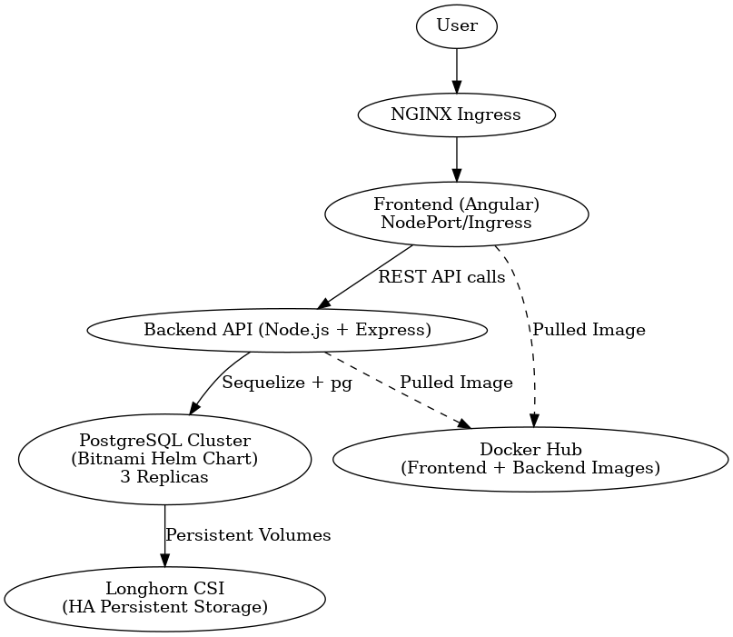

# 📇 Contact List App - DevOps Project

A fully containerized and production-ready **Contact List Application** built with:

- ✅ Angular (Frontend)
- ✅ Node.js + Express (Backend API)
- ✅ PostgreSQL (Highly Available Stateful Cluster)
- ✅ Longhorn CSI for Persistent Volume Management
- ✅ Kubernetes with Helm, Docker, and NGINX Ingress Controller

---

## 🔍 Problem Statement

In modern applications, ensuring **high availability (HA)** and **scalability** of services like databases and APIs is critical. This project demonstrates building a production-grade **Contact List** application where:

- The **database (PostgreSQL)** must be highly available with failover support.
- The application must be split into **frontend** and **backend**.
- All components must be **Dockerized**, deployed using **Kubernetes**, and managed via **Helm charts**.
- The backend API should be resilient and expose a clean interface to the Angular frontend.
- Persistent storage must be reliable and resilient using **Longhorn**.

---

## 🧩 Technology Stack

| Component        | Stack / Tool                |
|------------------|-----------------------------|
| Frontend         | Angular                     |
| Backend API      | Node.js + Express           |
| Database         | PostgreSQL (HA) via Helm    |
| Storage          | Longhorn CSI (HA volumes)   |
| Containerization | Docker                      |
| Orchestration    | Kubernetes + Helm           |
| Image Registry   | Docker Hub                  |
| Ingress          | NGINX Ingress Controller    |

---

## 🖼️ Architecture Diagram



---

## 📦 Dockerization

Each service is containerized with Docker:

- **Frontend:**
  ```bash
  docker build -t yourdockerhub/contactlist-frontend:latest ./frontend
  docker push yourdockerhub/contactlist-frontend:latest
- **Backend:**
  ```bash
  docker build -t yourdockerhub/contactlist-backend:latest ./backend
  docker push yourdockerhub/contactlist-backend:latest

🚀 Kubernetes Deployment Strategy
All components are deployed via Helm charts stored in helm/:

bash
Copy
Edit
helm install contactlist-backend ./helm/backend
helm install contactlist-frontend ./helm/frontend
helm install pg-release ./helm/postgresql
💾 PostgreSQL - High Availability
Deployed using Bitnami’s PostgreSQL Helm chart

Uses architecture=replication and replicaCount=3

Persistent Volumes provisioned via Longhorn CSI

Data survives pod restarts and node failures

bash
Copy
Edit
helm install pg-release bitnami/postgresql \
  --set architecture=replication \
  --set replicaCount=3 \
  --set auth.username=contactuser \
  --set auth.password=contactpass \
  --set auth.database=contactdb \
  --set primary.persistence.storageClass=longhorn \
  --set primary.persistence.size=2Gi \
  --set readReplicas.persistence.storageClass=longhorn \
  --set readReplicas.persistence.size=2Gi
🌐 Ingress Configuration
Exposed via NGINX Ingress Controller:

yaml
Copy
Edit
apiVersion: networking.k8s.io/v1
kind: Ingress
metadata:
  name: frontend-ingress
  annotations:
    nginx.ingress.kubernetes.io/rewrite-target: /
spec:
  ingressClassName: nginx
  rules:
  - host: example.com
    http:
      paths:
      - path: /
        pathType: Prefix
        backend:
          service:
            name: frontend
            port:
              number: 80
Add /etc/hosts entry for local DNS:

bash
Copy
Edit
echo "192.168.x.x example.com" | sudo tee -a /etc/hosts
🧪 Accessing the Application
Frontend: http://example.com/

Backend API: ClusterIP or through NodePort for testing

PostgreSQL: Only accessible internally by backend

📁 Folder Structure
bash
Copy
Edit
innovation_devops/
│
├── backend/                 # Node.js + Express API
├── frontend/                # Angular UI
├── helm/                    # All Helm charts
│   ├── backend/
│   ├── frontend/
│   └── postgresql/
├── contact-list-ha-architecture.png  # Architecture Diagram
├── README.md
└── docker-compose.yml      # For local development
🛡️ Dependencies
Longhorn requires open-iscsi to be installed on all worker nodes.

Make sure CSI is installed and running before provisioning PVCs.

📣 Contributing
Feel free to fork and PR. All enhancements and suggestions are welcome!
